<div align="center">

# YTD Studio

**Watch YouTube without ads, save anything in one click, and keep it all organized.**
A desktop app for Windows and macOS, plus apps for Android and iPhone, with an optional AI layer that finds videos *for you*.

[Download the latest release](../../releases/latest) · [Features](#features) · [macOS](#macos-app) · [iPhone](#iphone-and-ipad-app) · [Android](#android-app) · [AI](#ai-discover-summaries-and-smart-playlists-ollama) · [Build from source](#quick-start)

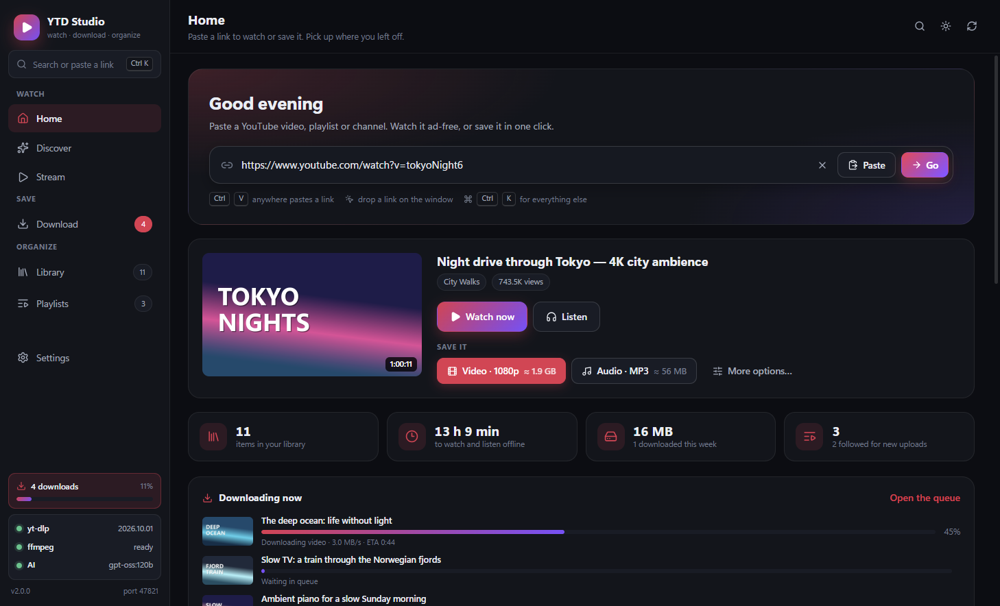

</div>

---

## What's new in 2.0

A complete redesign with a new **Home** screen, a **command palette**, **pause and resume**, **clips**,
**SponsorBlock**, **subtitles in the player**, **auto-sync for followed channels**, **backup and restore**,
**accent colors** and a lot of small touches. New in 2.0: a **[macOS app](#macos-app)** (Apple Silicon and Intel),
a native **[iPhone and iPad app](#iphone-and-ipad-app)**, and a new app icon. See the [release notes](.github/release-notes/v2.0.0.md).

## Screenshots

| | |
| --- | --- |
| 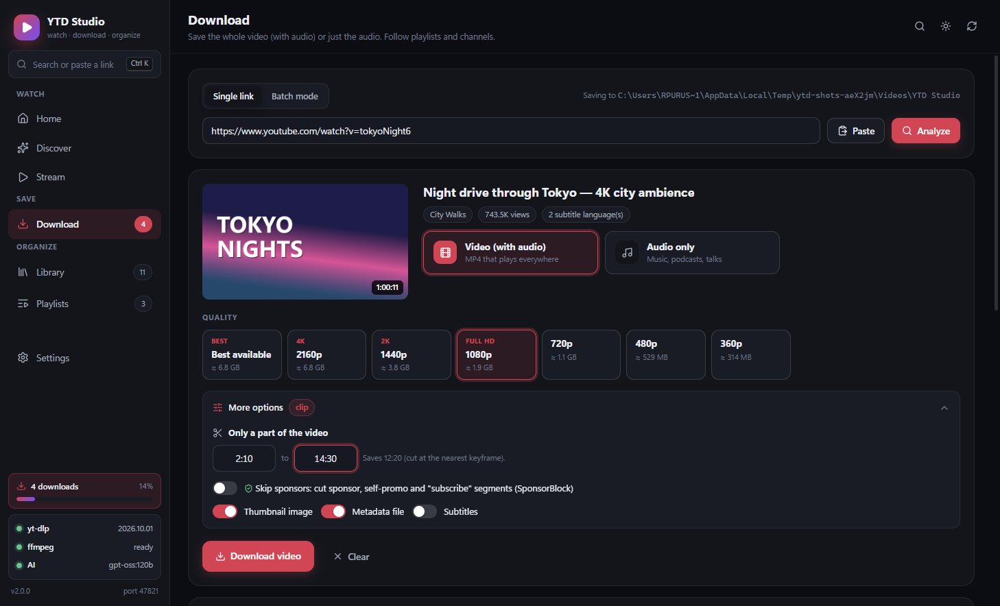 | 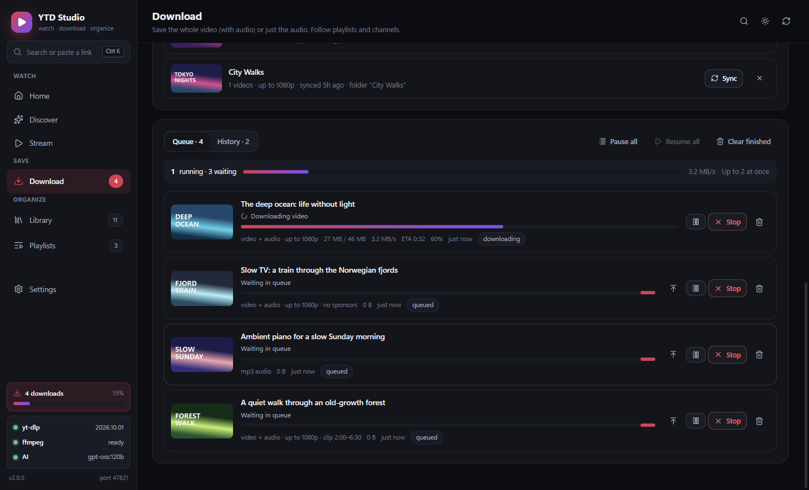 |
| **Download**: pick video or audio, see the size of every quality, cut a clip, skip sponsors. | **Queue**: live progress, pause / resume, "download next", Pause all, retry with a reason. |
| 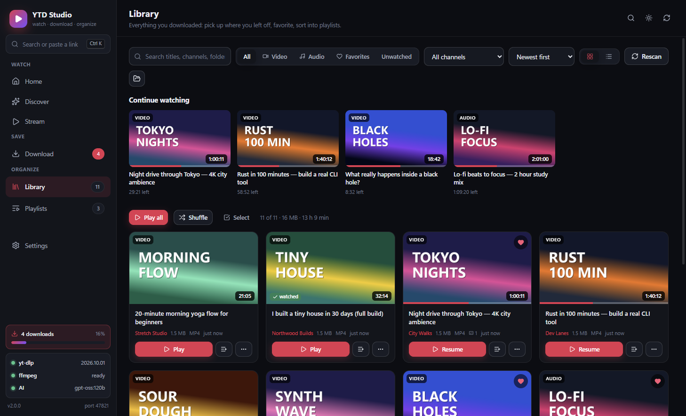 | 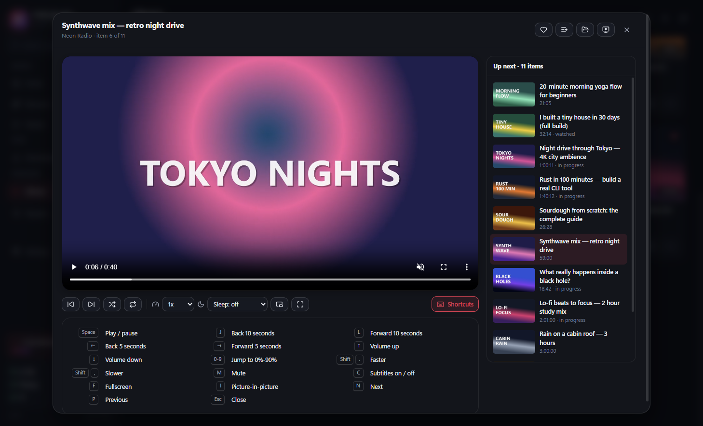 |
| **Library**: continue watching, favorites, channels, grid or list, multi-select. | **Player**: up next, shuffle, repeat, speed, subtitles, picture-in-picture, sleep timer. |
| 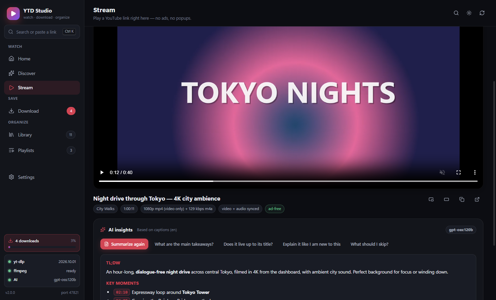 | 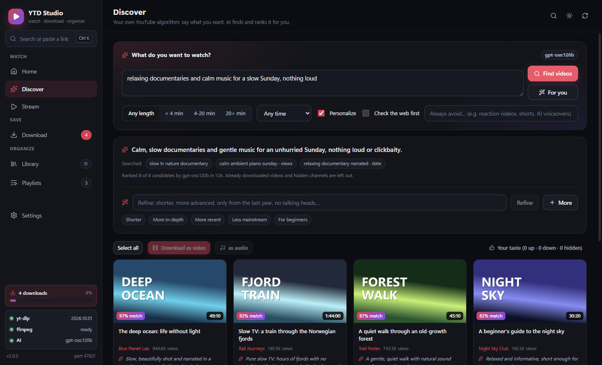 |
| **Stream** ad-free, with an AI *TL;DW* whose key moments seek the video. | **Discover**: describe what you want; AI plans the searches and ranks every result for you. |
| 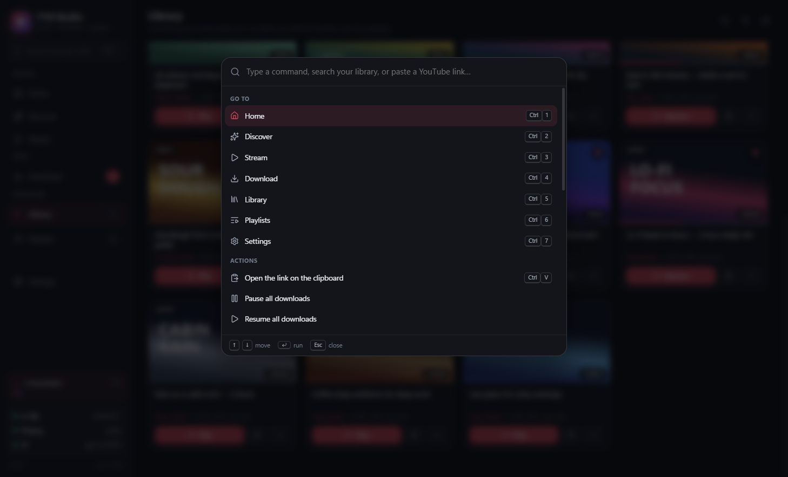 | 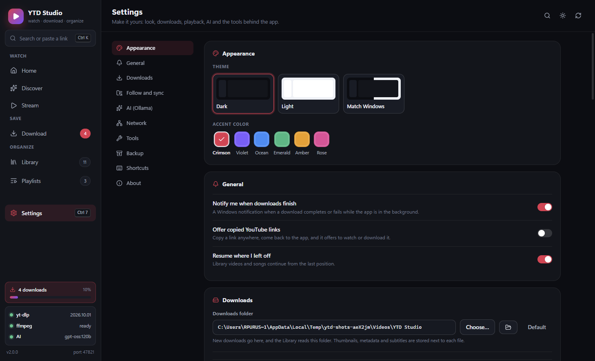 |
| **Ctrl+K** finds anything, runs any action, or acts on a pasted link. | **Settings**: dark / light / system, six accent colors, everything explained. |
| 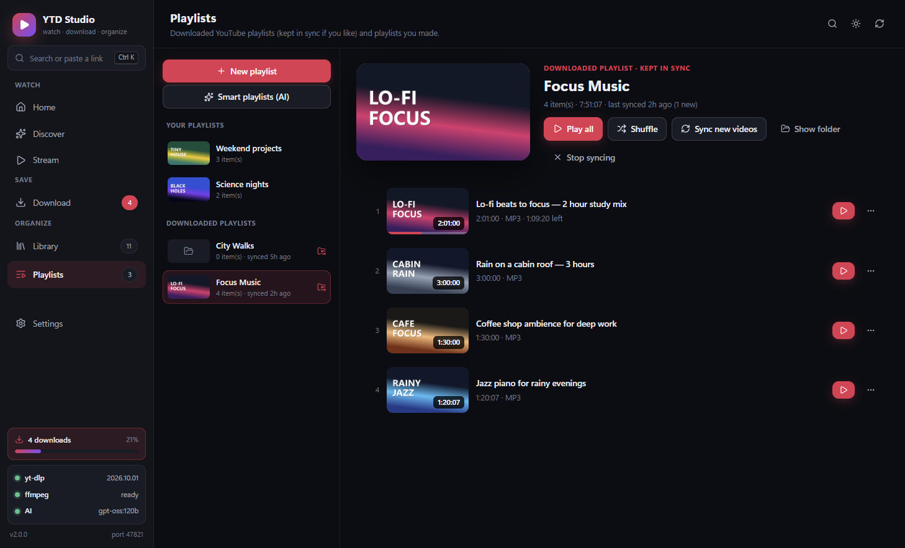 | 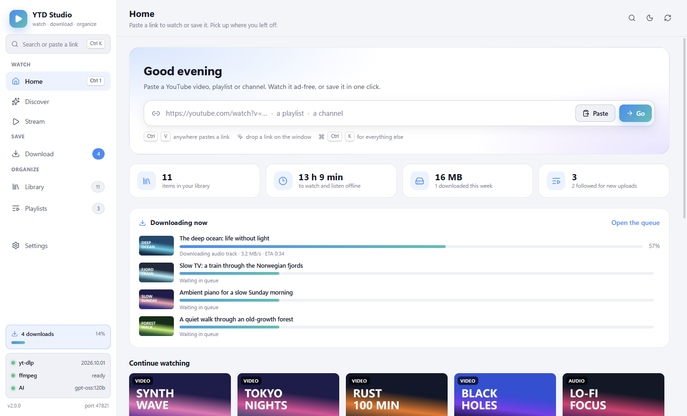 |
| **Playlists**: downloaded YouTube playlists (followed for new uploads) and your own. | **Light theme** with the Ocean accent. |

**Android**

| | | | |
| --- | --- | --- | --- |
|  | 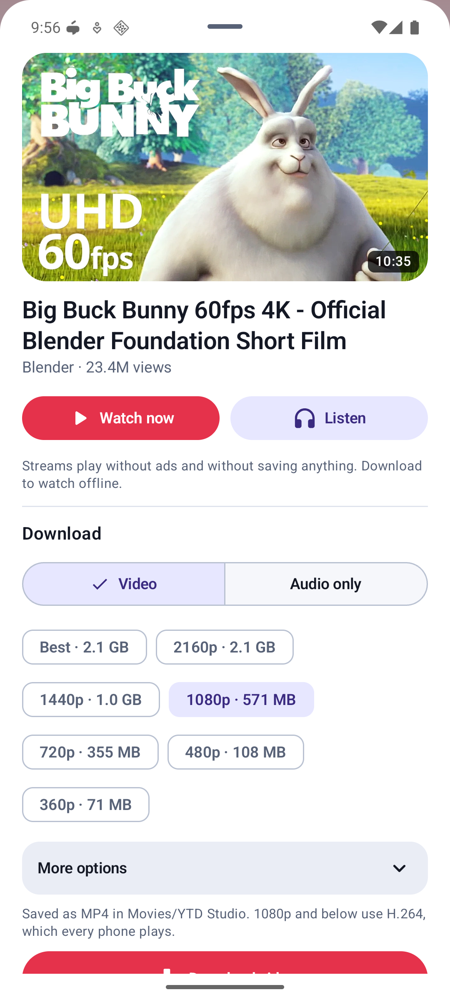 |  |  |
| Home | Paste or share a link | Downloads | Settings |

<sub>Screenshots use generated sample content (see `scripts/screenshots/`), not real YouTube videos.</sub>

## Features

**Get things in**

- **One link bar for everything** (Home): paste a video, a playlist or a channel and get the obvious actions:
  *Watch now*, *Listen*, *Video* (with its size) or *Audio* in one click, or every option.
- **Paste anywhere** (Ctrl+V outside a text field), **drop a link** on the window, or let the app **offer a link you
  just copied** when you come back to it. On Android, **Share** from the YouTube app.
- **Command palette** (Ctrl+K): jump to any screen, pause or resume everything, retry failures, switch theme or
  accent, back up, search your library, or paste a link to watch or download it right there.

**Download**

- **Video (with audio)** up to 4K as MP4, or **audio only** as MP3, M4A, OPUS, FLAC or WAV.
- **Size estimates** for every quality before you start.
- **Clips**: save only 2:10–14:30 of a video. **SponsorBlock**: cut sponsor, self-promo and "subscribe" segments.
- **Whole playlists in one click**, in their own folder and in order, and **follow** playlists and channels:
  Sync fetches only what is new, and **auto-sync** does it on a schedule (every 1 to 24 hours).
- A **queue** with live speed and ETA, **pause and resume** (continues from the partial file, also after a
  restart), **download next**, Pause all / Resume all / Retry failed, and a searchable history.
- **Errors explained**: "YouTube changed something" comes with an *Update yt-dlp and retry* button,
  age-restricted videos point to browser sign-in, and so on.
- **Speed limit**, **video codec** choice (compatible H.264 or best quality), embedded **cover art, chapters and
  tags**, subtitles, thumbnails, metadata, filename template, proxy and browser cookies.
- Windows **notifications** and **taskbar progress**; on Android a progress notification and background downloads.

**Watch and organize**

- **Stream** ad-free inside the app, with **picture-in-picture**, **theater mode** and **recently streamed**.
- A **player** with up next, autoplay, shuffle, repeat, speed, **subtitles**, picture-in-picture, a
  **sleep timer** and YouTube-style shortcuts (press **?** to see them all). It **resumes** where you stopped.
- A **Library** with *Continue watching*, favorites, watched / unwatched, channel filter, six sort orders,
  grid or list, and **multi-select** (play, add to a playlist, favorite, mark watched, delete).
- **Playlists**: downloaded YouTube playlists in order, plus **your own** (create, rename, reorder, shuffle).
- **Backup and restore**: favorites, progress, playlists, followed channels, AI feedback and settings in one file.
- **Make it yours**: dark, light or system theme and six accent colors (Crimson, Violet, Ocean, Emerald, Amber, Rose).

**AI (optional, Ollama)**

- **Discover**: your own YouTube algorithm. Describe what you want in plain words; the model plans the searches,
  the app runs them, and the model ranks every result for *you*, with a reason for each pick.
- **AI insights**: a streamed *TL;DW* of any video from its captions, with **clickable key moments**, and a chat
  to ask questions about it.
- **Smart playlists**: the model sorts your library into themed playlists; you pick which ones to create.

### Keyboard shortcuts (desktop)

| Keys | Does |
| --- | --- |
| <kbd>Ctrl</kbd>+<kbd>K</kbd> | Command palette: search, paste a link, run any action |
| <kbd>Ctrl</kbd>+<kbd>V</kbd> | Paste a YouTube link anywhere to open it |
| <kbd>Ctrl</kbd>+<kbd>1</kbd> … <kbd>7</kbd> | Home, Discover, Stream, Download, Library, Playlists, Settings |
| <kbd>Space</kbd> / <kbd>K</kbd> | Player: play / pause |
| <kbd>J</kbd> / <kbd>L</kbd>, <kbd>←</kbd> / <kbd>→</kbd> | Player: back / forward 10 s, 5 s |
| <kbd>↑</kbd> / <kbd>↓</kbd>, <kbd>M</kbd> | Player: volume, mute |
| <kbd>0</kbd> … <kbd>9</kbd> | Player: jump to 0 % … 90 % |
| <kbd>Shift</kbd>+<kbd>.</kbd> / <kbd>Shift</kbd>+<kbd>,</kbd> | Player: faster / slower |
| <kbd>C</kbd>, <kbd>I</kbd>, <kbd>F</kbd> | Player: subtitles, picture-in-picture, fullscreen |
| <kbd>N</kbd> / <kbd>P</kbd>, <kbd>?</kbd> | Player: next / previous, all shortcuts |

---

## Download the builds

The easiest way: open the [latest release](../../releases/latest) and download

| File | For |
| --- | --- |
| `YTD-Studio-…-setup.exe` | Windows |
| `YTD-Studio-…-mac-arm64.dmg` | Macs with Apple Silicon (M1 and newer) |
| `YTD-Studio-…-mac-x64.dmg` | Intel Macs |
| `YTD-Studio-…-iOS-unsigned.ipa` | iPhone and iPad, [installed with AltStore or Sideloadly](#installing-on-iphone-or-ipad) |
| `…-arm64-v8a-release.apk` | Practically every Android phone |

GitHub Actions also builds every app on every push (`.github/workflows/build.yml`):

1. Open the repository's **Actions** tab and pick the latest **Build** run.
2. Under **Artifacts**, download **YTD-Studio-Windows** (the installer), **YTD-Studio-macOS** (the disk
   images), **YTD-Studio-iOS** (the IPA) and/or **YTD-Studio-Android** (the APKs).

Pushing a tag such as `v1.0.1` also creates a **GitHub Release** with all of them attached, which is easier
to open on a phone (no sign-in or zip file).

## Quick start

```powershell
pnpm install
pnpm dev          # development window with hot reload
```

```powershell
pnpm build        # compile main / preload / renderer into out/
pnpm start        # run the compiled app
pnpm dist         # NSIS installer in release/
pnpm exec electron-builder --mac dmg   # on a Mac: disk images in release/
pnpm dist:dir     # unpacked app in release/win-unpacked/
pnpm typecheck    # tsc for the node and web projects
```

---

## First run

**yt-dlp and ffmpeg are not part of this repository or the installer.** Both are downloaded by the app
itself the first time it starts, into `%APPDATA%/YTD Studio/bin` (macOS: `~/Library/Application Support/YTD Studio/bin`),
and that copy is used from then on:

- **yt-dlp**: the newest `yt-dlp.exe` from the official GitHub release.
- **ffmpeg + ffprobe**: the Windows release build from gyan.dev (about 115 MB; falls back to
  yt-dlp's FFmpeg-Builds on GitHub). On macOS, the static builds from ffmpeg.martin-riedl.de for your
  Mac's chip (falls back to evermeet.cx); a Homebrew `ffmpeg` / `yt-dlp` is used if you already have one. Only `ffmpeg.exe`, `ffprobe.exe` and the license text are
  extracted. They are only needed to join separate video and audio streams (1080p and up) and to
  convert audio to MP3/WAV/FLAC/OPUS.

Progress shows in the top bar. If a download fails (offline, proxy, blocked), the app keeps working
in a reduced mode and a banner offers **Install yt-dlp** / **Install ffmpeg** to retry. You can also
point the app at your own copies in Settings > Tools (a custom path wins over the managed copy, and
a managed copy wins over anything on PATH).

Without ffmpeg the app still works in a reduced mode: video downloads use the lower-quality
single-file formats YouTube offers (some videos have none), and audio is saved as M4A.

### Keeping yt-dlp current

YouTube changes constantly, so an out-of-date yt-dlp is the most common cause of failures. The app:

- checks GitHub for the latest release on every launch (silently, cached for 30 minutes),
- shows a **yt-dlp available** button in the top bar when you are behind,
- offers **Check for updates** / **Update** buttons in Settings.

---

## AI: Discover, summaries and smart playlists (Ollama)

Everything AI is optional and off until you connect a model. It works the same on the desktop and on
Android (see [Android: AI](#android-ai) for the differences). Open **Settings > AI (Ollama)**:

1. **Server**: *Ollama Cloud* (`https://ollama.com`, the default) or *Local Ollama* (`http://localhost:11434`).
2. **API key** (needed for the cloud): create one at [ollama.com/settings/keys](https://ollama.com/settings/keys)
   and paste it. It is stored encrypted with your OS keychain (Electron `safeStorage`; Windows DPAPI) in
   `ai-key.json`, stays in the main process (the UI only learns "a key ending in ...7f3a is saved"), and is
   only sent to your AI server (HTTPS or this machine, never plain HTTP to another machine) and to Ollama
   web search. The `OLLAMA_API_KEY` environment variable works too.
3. **Model**: picked from the server's list (`/api/tags`). A strong default is chosen for you; **Test**
   sends one tiny prompt. Bigger models rank and summarize better, smaller ones answer faster.

### Discover: your own recommendation algorithm

YouTube's recommendations optimize for watch time. Discover optimizes for what you asked:

```text
"honest reviews of budget mechanical keyboards, no unboxings"
   │
   ├─ taste profile (optional) ── channels you download most, favorites, finished videos,
   │                              thumbs up/down, hidden channels, recent requests
   ├─ web lookup (optional) ───── Ollama web search, for new releases and current events
   ▼
 PLAN   the model writes 3-6 diverse searches, each with a sort (relevance / upload date / views),
        plus length bounds and whether Shorts make sense
   ▼
 SEARCH yt-dlp runs them as real YouTube results pages with YouTube's own filters
        (videos only, upload date, duration, sort), 3 at a time
   ▼
 FILTER drop duplicates, Shorts, live streams, channels you hid, videos you disliked and
        videos you already downloaded
   ▼
 RANK   the model scores every candidate 0-100 for this request and your taste, penalizing
        clickbait, reuploads and off-topic results, and says why each pick fits
```

- **Refine** ("shorter", "more advanced", "no talking heads") keeps the original request and stacks
  follow-ups; **Undo** drops the last one. **More** fetches new videos without repeats.
- **Thumbs up / down** and **Never show this channel** are remembered (`ai-taste.json`) and shape every
  later ranking. *Your taste* lists them and forgets any item with one click.
- Length and upload-date filters in the bar apply to every search; **Personalize** and **Check the web
  first** are remembered in Settings.
- Results play in the Stream tab, download as video or audio (one or many), or open an AI summary first.

### AI insights on any video

The Stream tab (and the summary button on Discover results) reads the video's captions through yt-dlp:
uploaded English subtitles first, then the captions in the language spoken, then anything available.
YouTube's rolling automatic captions are de-duplicated and compacted into `[mm:ss]` lines (long videos are
thinned evenly so the transcript stays around 12k tokens). The summary streams in as *TL;DW*, *Key moments*
and *Worth watching?*; every `[mm:ss]` is a button that seeks the player. Questions are answered from the
same transcript, with timestamps. Videos without captions fall back to the description and chapters.

### Smart playlists

**Playlists > Smart playlists (AI)** sends titles, channels and lengths of up to 300 library items, gets back
3-10 themed groups, and shows them for review. Nothing is created until you click **Create**.

### What is sent where

Only when you use an AI feature: your request; titles, channels, lengths and view counts of search
results; (with Personalize) titles and channels from your library and your feedback; and the captions of
videos you summarize or ask about. All of it goes to the server in Settings; web lookups go to Ollama web
search. Nothing is sent in the background.

---

## How it works

```text
src/
  main/            Electron main process (Node)
    index.ts         window creation, single-instance lock, bootstrap
    ipc.ts           typed IPC surface (every call returns { ok, data | error })
    ytdlp.ts         binary discovery, auto-install, update checks, probing, format selection
    ffmpeg.ts        ffmpeg discovery (settings, managed copy, PATH, winget/choco/scoop), auto-install, version
    stream.ts        turns a video into playable stream URLs (video-only + audio-only)
    media-server.ts  localhost HTTP server: proxies YouTube media with Range support,
                     serves files from the downloads folder, proxies thumbnails
    downloads.ts     queue, concurrency, live progress parsing, history persistence
    library.ts       scans the downloads folder and pairs sidecar thumbnails/metadata
    library-state.ts favorites, watch progress, your playlists and synced YouTube playlists (library-state.json)
    sync.ts          Sync of followed playlists / channels, and the auto-sync schedule
    backup.ts        backup file export and merge-on-import
    settings.ts      JSON-backed settings store
    ai/
      ollama.ts        Ollama client (streamed chat, structured JSON, models, web search), encrypted API key
      discover.ts      plan searches, YouTube filter encoding, search, filter, rank
      transcript.ts    caption track choice, WebVTT parsing, timestamped transcript for prompts
      insights.ts      summaries, questions about a video, smart playlists
      taste.ts         thumbs up/down, hidden channels, recent requests (ai-taste.json)
  preload/         contextBridge API exposed as window.api
  renderer/        React UI (Home / Discover / Stream / Download / Library / Playlists / Settings, player
                   overlay, command palette, copied-link prompt, toasts with actions)
  shared/          types and IPC channel names used by both sides
scripts/smoke.mjs  end-to-end UI test driven over the Chrome DevTools Protocol
scripts/e2e/       end-to-end test with a fake yt-dlp, media host and Ollama (runs in CI)
scripts/screenshots/ the README screenshots, from generated sample content
```

### Download modes

| Mode | With ffmpeg | Without ffmpeg |
| --- | --- | --- |
| Video (with audio) | Best video up to your chosen resolution (H.264 preferred, or any codec with "Best quality") plus best audio, merged into MP4 | Best single-file format with both video and audio |
| Audio only | Converted to MP3 / M4A / OPUS / WAV / FLAC | Saved as M4A, unconverted |
| Clips, SponsorBlock, embedded cover art and chapters | Supported (`--download-sections`, `--sponsorblock-remove`, `--embed-*`) | Not available |

**Pause and resume**: pausing stops yt-dlp but keeps its partial file, and Resume runs it again with the same
options, so it continues where it stopped (`.part` files). Downloads that were running when the app closed come
back as *paused*. The options each job was queued with are stored with it, so Retry and Resume use them too.

### Streaming

A browser `<video>` element cannot play a YouTube watch page, and pointing it straight at a
googlevideo URL breaks on expiry, missing headers, and seeking. So the main process runs a small
HTTP server on `127.0.0.1:47821` that resolves the requested quality through yt-dlp, streams the
bytes through with the right headers (forwarding `Range` so scrubbing works), re-resolves expired
URLs automatically, serves your downloaded files, and proxies thumbnails.

YouTube also needs a JavaScript runtime for yt-dlp to see the full format list (without one it
falls back to a limited client whose formats are mostly HLS, which `<video>` cannot play). Electron
already contains Node, so the app passes `--js-runtimes node:<its own executable>` and runs that in
plain-Node mode (`ELECTRON_RUN_AS_NODE=1`); nothing extra to install. The proxy only offers plain
HTTPS formats to the player and reads googlevideo in bounded 10 MB ranges with the headers yt-dlp
reports, the same way yt-dlp downloads them.

High resolutions have no single muxed stream, so the app plays the video-only and audio-only
streams together: the visible video element (with the normal player controls) is the clock, and a
hidden audio element follows it (about 0.3s tolerance). Volume and mute are mirrored to the audio.

### Security

`contextIsolation: true`, `nodeIntegration: false`, `sandbox: true`. The renderer never touches the
filesystem or spawns processes; it only calls the whitelisted preload API. The media server binds to
loopback, only serves files under your downloads folder, and only proxies images from YouTube hosts.
External links open in your real browser.

---

## End-to-end smoke test

`scripts/smoke.mjs` drives the real app over the DevTools Protocol: shell, Settings tab, a live
stream, a real audio download, and the Library listing.

```powershell
# Note: if ELECTRON_RUN_AS_NODE is set in your shell (VS Code does this), clear it first.
Start-Process -FilePath "node_modules/electron/dist/electron.exe" -ArgumentList ".", "--remote-debugging-port=9222"
node scripts/smoke.mjs
```

---

## Troubleshooting

| Symptom | Fix |
| --- | --- |
| "yt-dlp is not installed" | Settings > **Install yt-dlp** (or the button in the top bar). |
| Downloads suddenly fail with an extractor error | Settings > **Check for updates**. YouTube changed something. |
| Video download says it needs ffmpeg, or audio is M4A instead of MP3 | Click **Install ffmpeg** (banner or Settings > Tools). |
| Stream shows video but it is capped at 360p/720p | Normal for some videos; downloads still get full quality (with ffmpeg). |
| Age-restricted or private video fails | Settings > **Browser cookies** > pick your browser. |
| A playlist only queues some videos | Use **Download whole playlist**, or tick the videos you want and use **Download N selected**. Up to 2000 entries are read. |
| A synced playlist re-downloads nothing new | Sync only fetches videos that were not in the playlist when it was saved or last synced. Videos you unticked then are skipped on purpose. |
| Port 47821 busy | The app automatically falls back to a random free port. |
| AI: "rejected the request (401)" | The API key is wrong or revoked. Settings > AI > **Replace** and paste a new one. |
| AI: "usage limit reached (429)" | Your Ollama plan's limit for now. Wait, or pick a smaller model. |
| AI: "model ... is not available" | The model was removed or renamed. Settings > AI > **Refresh list** and pick another. |
| AI summary says there is no transcript | The video has no captions; the summary is based on the description and chapters only. |
| Discover results feel generic | Turn on **Personalize**, give a few thumbs up/down, or use a bigger model. |
| A download says "YouTube changed something" | Click **Update yt-dlp and retry** on the failed download. |
| A clip or SponsorBlock option is greyed out | Both need ffmpeg: click **Install ffmpeg**. |
| I paused a download and closed the app | It is still there as *paused*; **Resume** continues from the partial file. |
| The copied-link prompt gets in the way | Settings > General > **Offer copied YouTube links** turns it off. |

Logs live in `%APPDATA%/YTD Studio/app.log`; the downloaded yt-dlp and ffmpeg live in `%APPDATA%/YTD Studio/bin`.

---

## macOS app

The desktop app runs on macOS 12 or newer, natively on Apple Silicon and Intel: the same Home, Discover,
Stream, Download, Library, Playlists, Settings and AI features as on Windows. Shortcuts use <kbd>⌘</kbd>
instead of <kbd>Ctrl</kbd> (⌘K, ⌘1 … ⌘7, ⌘V), the standard Mac menus are there, and closing the window keeps
downloads running (click the Dock icon to bring it back).

**Installing:** open the `.dmg` for your Mac (`mac-arm64` for Apple Silicon, `mac-x64` for Intel) and drag
*YTD Studio* to Applications. The app is signed ad hoc but not notarized (that needs a paid Apple developer
account), so the first time, **right-click the app > Open > Open**. On macOS 15 and newer, open it once,
then go to **System Settings > Privacy & Security** and click **Open Anyway**. Or, in Terminal:

```bash
xattr -dr com.apple.quarantine "/Applications/YTD Studio.app"
```

Logs and the downloaded tools live in `~/Library/Application Support/YTD Studio/`.

## iPhone and iPad app

`ios/` is a native SwiftUI app (iOS 16 or newer). iOS does not allow apps to run yt-dlp, so it uses
[YouTubeKit](https://github.com/alexeichhorn/YouTubeKit), a Swift library that reads YouTube's stream
links on the device, and Apple's own AVFoundation to join video and audio.

| Tab | What it does |
| --- | --- |
| Home | Paste a link (or open `ytdstudio://open?url=<link>` from a Shortcut) and get **Watch now** (ad-free, picture-in-picture, AirPlay), **Listen** (keeps playing with the screen off), one-tap **Video** (your default quality) and **Audio** downloads, and every quality with its exact size. *Continue watching* below. |
| Downloads | Live queue (two at a time) with progress, cancel, retry and Retry failed. |
| Library | Videos and audio with search, filters (videos, audio, favorites), five sort orders, favorites, watched state and resume. Share a file, save a video to Photos, copy the YouTube link. |
| Settings | Default video quality, the optional fallback server, storage used, delete all. |

Videos are saved as MP4 (H.264, up to 1080p; the higher resolutions YouTube only serves as VP9/AV1, which
iOS cannot save as MP4 without re-encoding) and audio as M4A. Everything is in the **Files** app under
*On My iPhone > YTD Studio*, in `Videos/` and `Music/`. When YouTube changes something and on-device
extraction fails, the app can ask the YouTubeKit server for the links (Settings > *Fallback server*, on by
default; only the video ID is sent). Not in the iOS app yet: playlists and channels, clips, SponsorBlock and
the AI features.

### Installing on iPhone or iPad

Apple only lets App Store apps or apps signed for your own device run on an iPhone, so the release has an
**unsigned IPA** for a sideloading tool, which signs it with your own Apple ID:

1. Install [AltStore](https://altstore.io) (or [Sideloadly](https://sideloadly.io)) on your computer and
   follow its setup.
2. Download `YTD-Studio-<version>-iOS-unsigned.ipa` and open it with AltStore / drop it on Sideloadly.
3. On the phone: Settings > General > VPN & Device Management > trust your Apple ID (and, on iOS 16+,
   turn on Settings > Privacy & Security > **Developer Mode**).

With a free Apple ID the signature lasts 7 days; AltStore refreshes it automatically.

### Building the iOS app yourself

Needs a Mac with Xcode 16 and [XcodeGen](https://github.com/yonaskolb/XcodeGen):

```bash
brew install xcodegen
cd ios
xcodegen generate         # creates YTDStudio.xcodeproj from project.yml
open YTDStudio.xcodeproj  # pick your team under Signing & Capabilities, then Run on your phone
```

```text
ios/YTDStudio/
  App/YTDStudioApp.swift    app entry, tabs, ytdstudio:// links
  Model/YouTubeService      YouTubeKit look-up, formats and sizes, oEmbed for the channel name
  Model/Fetcher             chunked (8 MB) downloads with the right user agent; Merger joins MP4s (no re-encode)
  Model/DownloadManager     the queue: two at a time, progress, cancel, retry, background time
  Model/Library             saved files in Documents, thumbnails, favorites, watch progress
  Model/PlayerModel         one AVPlayer for streams and files, fallbacks, resume, lock-screen info
  Views/                    Home, Downloads, Library, Settings, full-screen player
```

---

## Android app

`android/` is a native Kotlin + Jetpack Compose (Material 3) app with the same idea: paste a link (or
**Share** a video from the YouTube app to *YTD Studio*), then watch it right away or download it, and
watch and organize everything offline.

| Tab | What it does |
| --- | --- |
| Home | A greeting and one link bar: paste (or share) a video or playlist and a sheet offers **Watch now**, **Listen** (audio only) or **Download** with the size of every quality, an optional **clip** range and **SponsorBlock** (a whole playlist in one tap, optionally kept in sync). A chip offers a copied link. Below: stats, *Continue watching*, *Recently added*, *Recently streamed*, your playlists and favorites. |
| Library | Videos (grid or list), Music, Playlists and Favorites tabs, with search, sorting, play all and shuffle. **Long-press to select several** and play, add to a playlist, favorite, mark watched or delete them together. Every item has favorite, add to playlist, mark (un)watched, share, open with and delete. Playlists: downloaded YouTube playlists (in order, with Sync) and your own (create, rename, reorder, remove). |
| Downloads | Live queue with overall progress, stages ("Downloading video", "Merging video and audio", "Saving..."), **pause / resume**, **download next**, Pause all / Resume all, a searchable history with **Retry failed**, explained errors with an *Update yt-dlp and retry* button, and your followed playlists and channels with **Sync** / **Sync all**. Downloads keep running in the background with a progress notification. |
| Discover | The [AI Discover](#discover-your-own-recommendation-algorithm) feed: describe what you want (or tap **For you**), get ranked videos with reasons, refine, thumbs up/down, hide channels, then Play, Summary or Download. |
| Settings | **AI (Ollama)**: server, API key, model, test. Theme (system / light / dark), **six accent colors** or Material You colors, playback (resume, picture-in-picture, background play for videos), download defaults (quality, codec, audio format, speed limit, SponsorBlock, embedded tags and chapters), playlist folders, **auto-sync** when the app opens, **backup and restore**, yt-dlp version and updates. |

The player runs as a media session: music keeps playing in the background with lock-screen and
notification controls, videos shrink to **picture-in-picture** when you leave, and the queue has
next/previous, shuffle, repeat, playback speed and a **sleep timer** (15 to 90 minutes, or the end of the current
item). It resumes every file where you left off.

Files are saved through Android's MediaStore into **Movies/YTD Studio** (video) and
**Music/YTD Studio** (audio), playlists in a subfolder each, so they show up in Gallery and music
players and stay on the phone even if the app is uninstalled. No storage permission is needed.
Android 10 or newer.

### Android: AI

The same Discover, insights and smart playlists as the desktop app, in Kotlin (`ai/`): same prompts,
same YouTube search filters, same ranking and feedback. Differences:

- **API key**: encrypted with an AES key held in the **Android Keystore** (hardware-backed on most
  phones, never exportable); only the ciphertext is stored, and backups are off.
- **AI insights** live in the player: tap the sparkle button while a stream or a downloaded YouTube video
  plays, and the key moments in the summary seek the player. Discover's **Summary** opens the same sheet
  before you watch.
- **Smart playlists**: Library > Playlists > **Smart playlists**.
- **Your own server** works too: set the server to your computer's address, e.g. `http://192.168.1.20:11434`
  (start Ollama with `OLLAMA_HOST=0.0.0.0` so the phone can reach it). Plain HTTP is allowed for this;
  the API key is never sent over plain HTTP to another machine.

### Does Android need yt-dlp and ffmpeg? Yes, and they are inside the APK

- **ffmpeg is required.** YouTube serves anything above 360p as a separate video stream and audio
  stream; ffmpeg joins them into one MP4. It also converts audio to MP3 and embeds cover art.
- **yt-dlp is required** to read YouTube at all, and it is a Python program.
- **A JavaScript runtime is required** by current yt-dlp to solve YouTube's player challenges.

The desktop app downloads `yt-dlp.exe` and `ffmpeg.exe` on first run. Android cannot do that: apps
may not execute files they downloaded into their own storage (since Android 10). The app therefore
uses [youtubedl-android](https://github.com/JunkFood02/youtubedl-android) (the library behind
apps like Seal), which ships **CPython, ffmpeg/ffprobe and QuickJS as native libraries** (`lib*.so`)
inside the APK. Android installs those into the app's native library folder, which is allowed to
execute, and the app unpacks the Python standard library and ffmpeg's shared libraries into its
private storage on first launch (a few seconds, once).

yt-dlp itself is just a Python zip file that this Python runs. That is what allows the app to keep
it current: on launch (at most every 12 hours) and from **Settings > Check for update now** it
fetches the newest release from yt-dlp's GitHub, exactly like the desktop app does.

Because those binaries are per-CPU, the build produces one APK per CPU type (about 100 MB each):

| APK | For |
| --- | --- |
| `YTD-Studio-<version>-arm64-v8a-release.apk` | Practically every phone from the last 8 years. **Use this one.** |
| `YTD-Studio-<version>-armeabi-v7a-release.apk` | Old 32-bit phones |
| `YTD-Studio-<version>-x86_64-release.apk` | The Android emulator / Chromebooks |

### Installing on your phone

Download the APK on the phone (or copy it over), open it, and allow "install unknown apps" for your
browser or file manager when Android asks.

**Updates install over the old version only if both are signed with the same key.** Without
configuration, each CI build is signed with a fresh debug key, so you would have to uninstall
before installing a newer build. To keep one key, create a keystore once and add it as repository
secrets (Settings > Secrets and variables > Actions):

```bash
keytool -genkeypair -v -keystore ytd-release.jks -alias ytd -keyalg RSA -keysize 2048 -validity 10000
base64 -w0 ytd-release.jks   # copy the output
```

| Secret | Value |
| --- | --- |
| `ANDROID_KEYSTORE_BASE64` | the base64 text from above |
| `ANDROID_KEYSTORE_PASSWORD` | the keystore password |
| `ANDROID_KEY_ALIAS` | `ytd` |
| `ANDROID_KEY_PASSWORD` | the key password (same as the keystore password if you did not set one) |

Keep `ytd-release.jks` somewhere safe and never commit it. Every build is numbered with the CI run
number, so newer builds always install as updates.

### Building the APK locally

Needs JDK 17 and the Android SDK (Android Studio installs both):

```bash
cd android
./gradlew assembleRelease     # APKs in android/app/build/outputs/apk/release/
```

### Android layout

```text
android/app/src/main/java/com/ytdstudio/android/
  engine/Engine.kt          yt-dlp: init, self-update, probe, download (progress + stages), stream URLs,
                            YouTube search pages and caption downloads for the AI features
  ai/                       Ollama client (streamed chat, structured JSON, web search), Keystore-encrypted
                            key, Discover (plan, search, filter, rank), insights from captions, smart
                            playlists, taste profile
  service/DownloadService   foreground service running the queue, progress notification, wake lock
  service/PlaybackService   Media3 session: background playback, media notification, watch progress
  data/                     job queue + history, library state (favorites, progress, playlists, synced
                            playlists), settings, MediaStore save/list per playlist folder (MediaLibrary)
  ui/                       Compose screens (Home, Discover, Library, Downloads, Settings, link sheet), player
                            screen with picture-in-picture, stream sources (10 MB chunked reads)
```

---

## Desktop end-to-end test (no YouTube needed)

`pnpm build && pnpm test:e2e` (Linux: wrap it in `xvfb-run -a`; Windows works too, a tiny launcher for the
fake yt-dlp is compiled with the C# compiler that ships with Windows) launches the real app with a
stand-in yt-dlp (`scripts/e2e/fake-ytdlp`) and a fake media host, and checks the queue, live
progress and stages, history, library grouping, in-app streaming, whole-playlist downloads into a
folder and Sync, favorites, your own playlists and resume. A fake Ollama server covers the AI features:
key handling, model pick, Discover's plan/search/filter/rank and feedback, streamed summaries with seeking
key moments, questions, and smart playlists. It also covers Home's one-click downloads, pause and resume,
the command palette, the copied-link prompt, clips with SponsorBlock, and subtitles served as WebVTT.
CI runs it on every push. The app runs against a throwaway data folder (`YTD_USER_DATA`), never yours.

## Screenshots

`pnpm build && node scripts/screenshots/capture.mjs` regenerates `docs/screenshots/` with the same fakes and
generated sample content (gradient thumbnails and a sample video made with ffmpeg's `gradients` and
`drawtext`). Needs python3 and ffmpeg.
Needs `python3` and `ffmpeg`.

---

## Licensing

YTD Studio's own code is MIT licensed (see [LICENSE](LICENSE)). It does not redistribute any third-party
downloader or media tool: [yt-dlp](https://github.com/yt-dlp/yt-dlp) (Unlicense) and
[FFmpeg](https://ffmpeg.org) (the downloaded build is GPL v3) are fetched onto the user's machine at
runtime and run as separate programs. The **Android APK is different**: it bundles yt-dlp, CPython,
FFmpeg and QuickJS through youtubedl-android (GPL-3.0), so the APK as a whole is distributed under
GPL-3.0 terms; its source is this repository. The **iOS app** contains YouTubeKit (MIT) and no GPL code.
See [THIRD_PARTY_NOTICES.md](THIRD_PARTY_NOTICES.md).
Use this app only for content you have the right to download.
